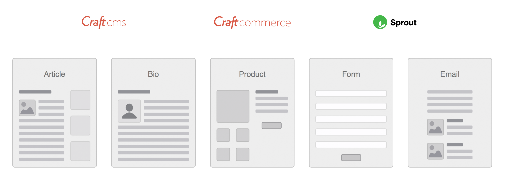
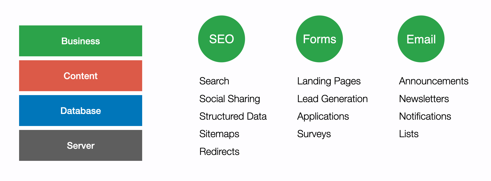

# Core Concepts

Sprout Marketing Suite is a premium suite of plugins designed for businesses who want to use Craft CMS as the core of content management and digital marketing workflows.

Sprout provides a seamless Craft experience for content authors and an exceptional amount of flexibility for designers and developers.

[//]: # (Sprout Plugins provide a seamless Craft experience for content authors, an exceptional amount of flexibility for designers and developers, and comprehensive multi-site support for multi-regional and multi-lingual websites.)

::: tip Craft 4 Support
Sprout Marketing Suite plugins are coming to Craft 4. See our [Road Map](./support/road-map.md) for more details.
:::

## Digital Marketing

Sprout adds new components to use in your content architecture including Forms, Emails, and Reports.

Where Craft provides the excellent content management features, Sprout adds components specialized toward business and marketing use cases.

## Modular Architecture

As we developed Sprout we observed that a lot of features that we designed could benefit more than one use case. For example, our Reports features can be used on it's own, for running reports on Form submissions in Sprout Forms, and to build dynamic email lists in Sprout Email.

Rather than re-invent the wheel in each **plugin**, we chose to build out features such as Reports as a **module** that can be used by all of our plugins and for your custom reporting needs as well. Users experience a unified, familiar workflow however they are using Reports on a site.

Modules can be enabled and disabled to ensure only the relevant ones are available to users. Explore the full list of [module features](./features.md). Collectively, these modules are referred to as the Sprout Framework.

## Plugin Bundles

The key Sprout Plugins bundle multiple modules to provide their feature set. View the [Lite and Pro](./features.md) page to see a breakdown of features in each module.

| Plugin             | Modules                              |
|:-------------------|:-------------------------------------|
| Sprout Forms       | Forms, Data Studio, Notifications    |
| Sprout Email       | Notifications, Campaigns, Sent Email |
| Sprout SEO         | Meta, Redirects, Sitemaps            |

While most websites benefit from the full feature set of the packages above, a few modules have been packaged in standalone plugins when they can also solve a narrow use case.

| Plugin             | Modules      |
|:-------------------|:-------------|
| Sprout Data Studio | Data Studio  |
| Sprout Sitemaps    | Sitemaps     |
| Sprout Redirects   | Redirects    |
| Sprout Sent Email  | Sent Email   |

[//]: # (| Sprout Marketing Suite | [All Modules]&#40;./features.md&#41; |)

View all of our plugins in the [Craft Plugin Store](https://plugins.craftcms.com/developer/169)

## Support & Training

Sprout Plugins are driven by real world projects and business and marketing requirements. If you depend on Craft CMS or Sprout Plugins as critical software for your online business, we offer Craft CMS audits, support, training, and consulting as standalone services and as compliments to our products.

- [Support](./support/support.md)
- [Training](./support/training.md)
