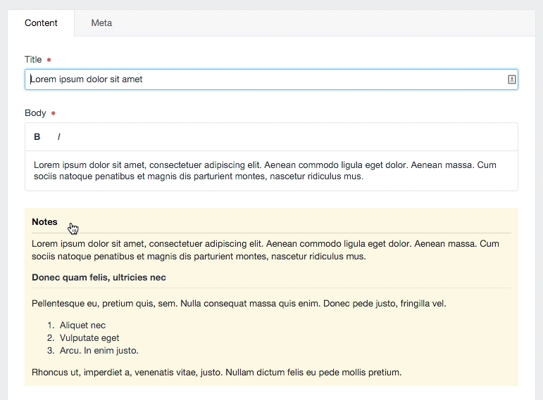

# Notes Field

The Notes Field comes with five styles which you can use to style your field's Instructions field.  You can update these styles in the _Plugin Settings_ and select which style you wish to use in the _Field Settings_.  Add the content you wish to be styled to your field's Instructions field (using HTML, Markdown, or plain text).

Notes fields can be expanded or collapsed on a user by user basis.



## Field Settings

To assign the Notes field type to your section, create a new Field and select the Type `Notes`.  Once you have selected the Notes field type, you can select your preferred style from the style dropdown.

## Plugin Settings

By default, Notes have five styles:

* Primary Information
* Secondary Information
* Warning
* Danger
* Highlight

Understandably, these are extremely deterministic naming conventions.  Ideally, in the future, we'd make it easy for you to update those names to whatever you prefer.  Right now, that's what you get. If you need another style, such as "Disco", you are just going to have to appropriate one of the above names for your devious cause.  If this is your dilemma, I'd recommend starting with _Danger_!

You can adjust your custom styles here.  If you want to be able to style each block individually, you have to target the field's ID in the CSS.  To do so, use the following naming convention in your CSS styles:

``` twig
#fields-{{ name }}-field {}
```

The `{{ name }}` value will get swapped out with your field's name to create the proper ID when the block is being rendered.  Currently, spacing matters, so use the `{{ name }}` value exactly as you see it in the other examples.

## Availability

| Craft Version | Available |
|:------------- |:---------:|
| Craft 3       | **✓** |
| Craft 2       | **✓** |

See here for documentation on the [Notes Field for Craft 3](./notes-field.md).

