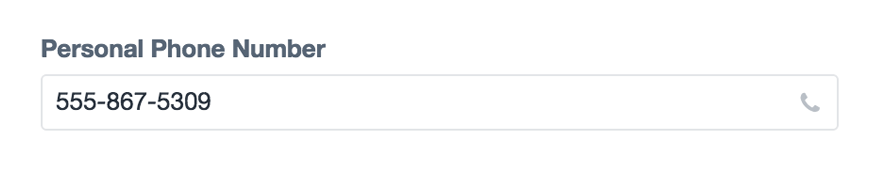

# Phone Field

The Phone Number field allows you to require a valid phone number pattern using Craft and Sprout Forms front-end Fields.

When a phone number is recognized, a _Phone_ icon appears at the right hand side of the phone field.  If you click on the _Phone_ link, your computer will open your primary phone program to initiate a call.

In the Control Panel, the Phone Field optionally supports masking which allows the user to see (as they type) the pattern of the required phone number format.

## Settings

For the phone field to validate, your input must match the number mask in your settings. By default, the mask is set to `###-###-####`.

**Custom Validation and Error Messages**

If you have more specific Phone Number validation needs, you can select the _Phone Numbers for this field have their own validation pattern_ setting and provide a custom **Validation Pattern** and **Error Message**.  Custom Validation Patterns support regular expressions and will be added as the pattern="" attribute on the front-end phone `input` field.

## Availability

| Craft Version | Available |
|:------------- |:---------:|
| Craft 3 (Url Field)      | **✓** |
| Craft 2 (Link Field)     | **✓** |

See here for documentation on the [Phone Field for Craft 3](./phone-field.html).

::: tip
The Phone Field works with Sprout Forms for Craft 2. This field is included by default in Sprout Fields for Craft 3.

Sprout Phone Field supports HTML5 client-side validation including the `required` attribute, the `phone` input type, and custom validation patterns and error messages.
:::

::: warning
The Phone Field has been reinvented for Craft 3 and will support more extensive International validation. Due to these updates, data from the Phone Field in Craft 2 will be migrated to use a Plain Text field in Craft 3 and you can migrate to or use the new Phone Field in Craft 3 as appropriate.
:::