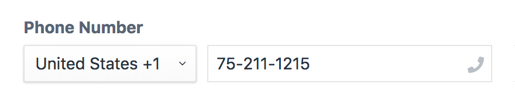

# Phone Field

The Phone Field Type helps you manage valid international phone numbers with a custom Phone Field.



When a phone number is recognized, a _Phone_ icon appears at the right hand side of the phone field. If you click on the _Phone_ link, your computer will open your primary phone program to initiate a call.

The Phone Field helps parse, format, and validate phone numbers for all countries and regions of the world.

## Templates

The Phone Field is provided to your Twig Template as a Phone Model with several options:

``` twig
{{ entry.phoneField.phone }} {# 707-541-4131 #}
{{ entry.phoneField.country }} {# US #}
{{ entry.phoneField.code }} {# 1 #}
{{ entry.phoneField.international }} {# +1 707-541-4131 #}
{{ entry.phoneField.national }} {# (707) 541-4131 #}
{{ entry.phoneField.E164 }} {# +17075414131 #}
{{ entry.phoneField.RFC3966 }} {# tel:+1-707-541-4131 #}
```

## Settings

Phone Numbers are validated based on the country that is selected. Validation is powered by Google's international phone number library `libphonenumber`.

By default, the Phone Field is setup for international addresses from all countries but can be limited to a single country as well.
