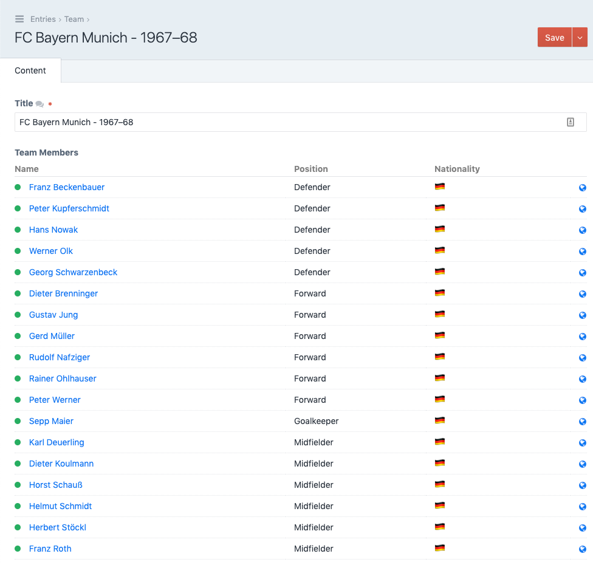

# Predefined Field

The Predefined Field allows you parse Twig and define the value of your field ahead of time. This can be useful to help optimize queries or prepare data for a specific use case before it is needed.

The Predefined Field is not editable.

## Settings

- **Field Format** - The value you want to prepare when the Predefined Field is saved.
- **Show Field** - Enable to display the value you saved in the Field Layout
- **Output Format** - The output method to use when displaying the value: Input, Textarea, or HTML 
- **Render dynamically in field layout** - Enable to process the value of the field when the page is loaded in the Control Panel

[Link Name](https://barrelstrengthdesign.com)

### Field Format

Define the value you want using the **Field Format** setting when you create your field. The Field Format setting can parse Twig and process values from the element being saved. 

The Field Format setting accepts Craft object syntax using the `object` variable to reference the current Element being saved:

``` twig
{{ object.title }}
{{ object.customField }}
{{ object.customField.first().id }}
```

And shorthand syntax:

``` twig
{title}
{customField}
{customField.first().id}
```

### Matrix Field Usage

Matrix Blocks are Elements too. If you use a Predefined Field within a matrix block, the `object` available to the Predefined Field is a `MatrixBlockModel` and any custom fields available in the Matrix Block:

``` twig
{{ object.type }}
{type}
```

To reference the parent Element of the Matrix Block, you can use the `owner` property:

``` twig
{{ object.owner.title }}
{{ object.owner.customField }}
{{ object.owner.customField.first().id }}
```

Or shorthand:

``` twig
{owner.title}
{owner.customField}
{owner.customField.first().id}
```

### Custom HTML

The Predefined Field can output any HTML that you want to show content authors. This allows for a lot of flexibility and should also be approached carefully as it also allows for a lot of abuse.

One use case for this configuration can be to show reverse relationships (the elements related to the one you are editing but that are created via the Field Layout of the other element). When displaying reverse relationships it's possible that the value that the Predefined field stored in the database when your element was saved is inaccurate, as the related values can change without updating your Predefined field value. In this case, you can enable the `Render dynamically in field layout` setting to re-process the value of the Predefined field when it is loaded in the Control Panel.

In the example below, the Predefined field shows the Users that are related to a given Entry and outputs a list of those related Users with links to their respective Entries in the Control Panel and on the front-end:

#### Dynamic HTML Output



#### Dynamic HTML Settings

   

#### Example HTML Table

The following table code can be used as an example to create a Craft-styled table:

``` twig
<table class="data fullwidth">
    <thead>
        <th>Name</th>
        <th>Position</th>
        <th>Nationality</th>
        <td class="thin"></td>
    </thead>
    
    <tr>
        <td><span class="status {{ user.getStatus() }}"></span> <a href="{{ user.getCpEditUrl() }}">{{ user.getFullName() }}</a></td>
        <td>{{ user.position }}</td>
        <td>🇩🇪</td>
        <td><a href="{{ user.getUrl() }}" target="_blank" data-icon="world" title="Visit webpage"></a></td>
    </tr>
    
</table>
```
