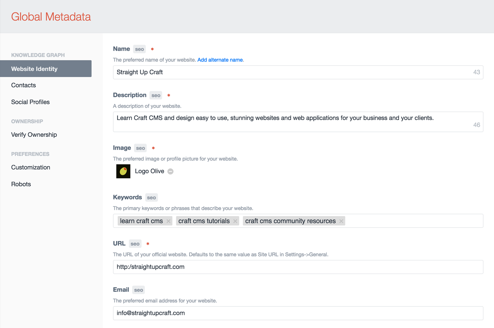
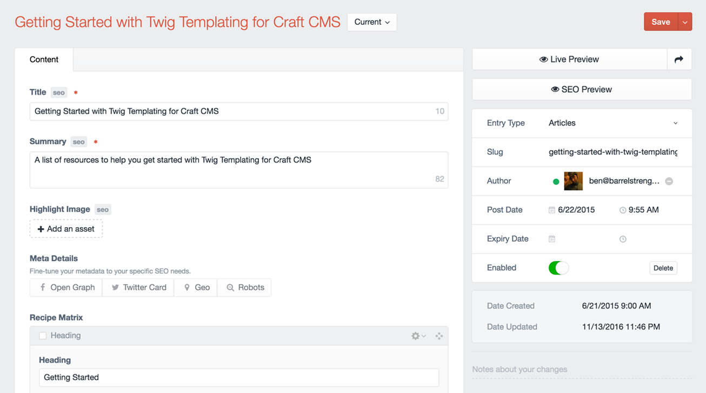

# About Meta Tags & Schema

> Metadata is content too

Sprout provides an intuitive, seamless, and flexible way to manage your SEO strategy within Craft CMS. Content authors will enjoy a clear visual relationship between content and metadata where they can focus on content and maximize visibility.

Throughout your content management experience, the Meta module will indicate which fields power the metadata on your site and provide some additional information about the scope and priority of how that field will affect your metadata.

Meta Tags and Structured Data will be automatically rendered in your templates (no template updates are required).

::: tip TECHNICAL METADATA
We use the term **Metadata** to refer to all types of Metadata together. More specifically we may refer to **Meta Tags**, which are traditional metadata, and **Social Sharing**, which relies on a series of more specific Meta Tags around two specifications (Open Graph and Twitter) but applies to many other mediums as well from Pinterest to Slack and more. The Meta module also let's you manage **Structured Data** (Knowledge Graph, Rich Cards) which supports many different **Schemas** and is output as JSON-LD in your templates.
:::

## Meta Tags

Often, the first time a visitor sees your content it is in search results or via the highlighted metadata when a link is shared in another application. Make sure you're treating your metadata like a first class citizen alongside your content. 

Manage Meta Tags including:

- Search (Title, Description, Image, etc.)
- Social Sharing (Facebook, Twitter, etc.)
- Robots (noindex, nofollow, etc.)

## Structured Data

Map your content in Craft CMS to the be output as Structured Data. The mapping between your content and the Structured Data that gets output is called a Schema. There are two types of mappings:

- **Default Schema Mappings** - a small, predictable subset of Schema Types and Properties that we can support out of the box. This will get you up and running and output more Structured Data for your content than the average website.
- **Custom Schema Mappings** - If you have more specialized content, the Meta module provides an extensive Schema API where you can map your content and custom fields and support more advanced schema mappings for your online and SEO strategies.

## Optimized Metadata

Refine your Metadata across three different levels of priority.

### Global Metadata

**Global Metadata** is managed from the SEO tab and filled out once when you setup the Meta module. Globals ensure you have metadata in place for your website identity and prepare Structured Data for your brand. Globals will help you communicate to the search engines information about your brand identity, how to get in touch, and general details so you always have something relevant about your business in search results and social sharing.



See the [Global Metadata in Templates](./examples-seo/global-metadata-in-templates.md) examples for more details.

### Element Metadata

**Element Metadata** is managed with the powerful [Metadata Field](./examples-seo/element-metadata-field.md). The Metadata field allows you to configure how your metadata is mapped for entry content. If you want to have a tight integration with your existing content fields, you can reuse existing fields and the Metadata field will blend right into your existing content. If you want detailed control, you can enable overrides for each type of metadata and manage it all manually.



See the [Metadata Field](./examples-seo/element-metadata-field.md) examples for more details.

### Template Metadata

**Template Metadata** allows you to modify your metadata in your Craft templates. While this can help with some scenarios, it is not always ideal as it makes it harder to give content authors control over all metadata in the Control Panel and increases the complexity of the codebase that needs to be managed over time.

::: warning PROCEED WITH CAUTION
Template Overrides should be considered a last resort. If you feel you have no other options and need to use them, reach out and [let us know](mailto:sprout@barrelstrengthdesign.com). We'd love to understand your use case so we can improve the Meta module and make it less likely you need to use Template Overrides in the future.
:::

See the [Template Metadata](./examples-seo/template-metadata-overrides.md) examples for more details.

## Developers

### Custom Schema

To add Custom Schema support for custom Structured Data mappings extend the `Schema` class and register your new class via `EVENT_REGISTER_SCHEMAS`.

``` php
use BarrelStrength\Sprout\meta\schema\Schema;

class MyCustomSchema extends Schema
{
  ...
}
```

See the Sprout codebase for examples.

## Settings

Read the [Config Settings](./configuration/sprout-config.md) documentation to explore and customize settings.

## Updates

See [update guides](/update-guides/seo.md) for the SEO and Framework modules.
