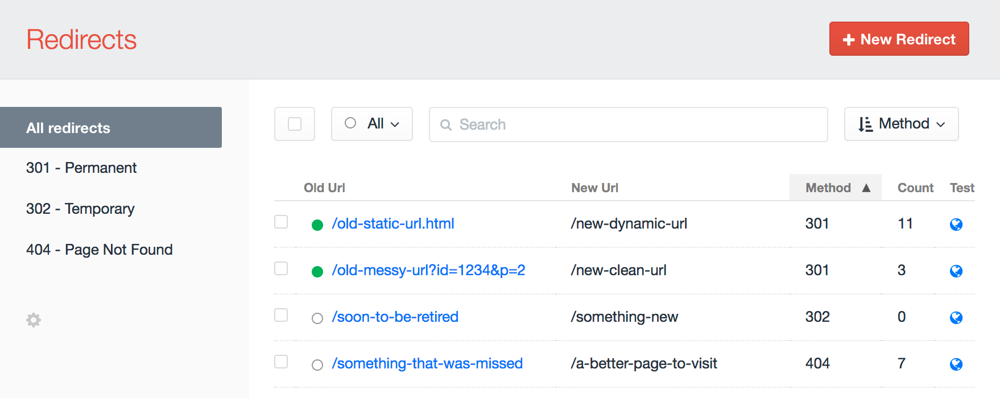
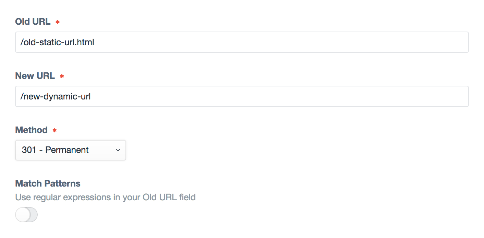
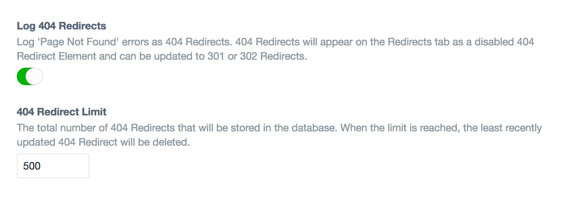

# About Redirects

The Redirects module enables content managers to manage Redirects, Short URLs, track 404s, and ensure all content is findable.

## Redirects

Redirects allow you to forward users and search engines to the appropriate content on your site. Redirects can be managed on a per-site basis directly in the Control Panel.

The Redirects module supports 3 types of redirects:

| Type | Description |
|:-------------:|:----------- |
| **301** | Redirect content that has permanently moved to a new location |
| **302** | Redirect content that has temporarily moved to a new location |
| **404** | Captures a 404 request and allows you to manually convert the URL that is 404ing into a 301 or 302 redirect. |

### Redirect Settings

Each Redirect has 4 settings, tracks the count of how many times it was used, and can be enabled or disabled.

| Setting                 | Description                                                                                                                                         |
|:------------------------|:----------------------------------------------------------------------------------------------------------------------------------------------------|
| **Old&nbsp;URL**        | The URL where your content used to live                                                                                                             |
| **New&nbsp;URL**        | The URL where your content will live in the future                                                                                                  |
| **Method**              | Indicate to search engines whether the redirect behavior is permanent or temporary                                                                  |
| **Match&nbsp;Patterns** | Enables additional checks to process more advanced patter matching in the redirects using regular expressions <Badge type="info" text="optional" /> |

### Bulk Actions

Redirects can be updated via bulk actions by selecting the checkboxes next to each Redirect on the Redirect listing page. Currently supported bulk actions include:

| Bulk Action      | Description                                                                                                                                                           |
|:---------------- |:----------------------------------------------------------------------------------------------------------------------------------------------------------------------|
| **Update&nbsp;Status&nbsp;to&nbsp;Enabled** | Updates a Redirect status to <Badge type="info" text="Enabled" />                                                                                                     |
| **Update&nbsp;Status&nbsp;to&nbsp;Disabled** | Updates a Redirect status to <Badge type="info" text="Disabled" />                                                                                                    |
| **Update&nbsp;Method&nbsp;to&nbsp;301** | Updates a Redirect Method to a 301 Redirect                                                                                                                           |
| **Update&nbsp;Method&nbsp;to&nbsp;302** | Updates a Redirect Method to a 302 Redirect                                                                                                                           |
| **Add&nbsp;to&nbsp;Excluded&nbsp;URLs** | Adds an Old URL to the Excluded URL List `Settings->Redirects->Excluded URL Patterns`   _This action only appears when 404 Redirects are selected._          |
| **Edit** | Opens a Redirect's Edit page in the Control Panel.   _This action only appears when a single Redirect is selected._                                             |
| **Delete** | Deletes a Redirect.                                                                                                                                                   |

### Pattern Matching

Redirect multiple URLs with a similar pattern by selecting the **Match Patterns** option. When the Match Patterns option is selected, you can then use _Regular Expressions_ in the Old URL field and reference _Capture Groups_ in the New Url field.

| Old Url - Regular Expressions    | New Url - Capture Groups    |
|:-------------------------------- |:--------------------------- |
| /old-location/(.*)               | new-location/$1             |
| /old-location/(\d{4})/(\d{2})    | new-location/$1/$2          |

### Order of Redirects

Redirects can be re-ordered via drag and drop when ordered by the `Structure` option on the Redirect listing page.

Redirects are processed from top to bottom as they are seen in the Structure view. If two or more redirects match a URL, the highest on the list will be the one that takes priority in how a particular URL is redirected.

## Performance

Redirects are not processed during a request until Craft tries all other Routing options. When a page is about to 404, the Redirects module will then check to see if a URL matches a Redirect rule and route things accordingly. This takes place between step 5 and 6 of Craft's [Routing](https://craftcms.com/docs/routing) rules. Waiting until the last moment allows you to optimize your website experience and page speed for the majority of your users while still helping redirect any people attempting to access old URLs to the right place.

## 404 Redirects

To monitor and capture 404 Redirects, you will need to enable them in your Redirect module settings: _Settings-Sprout->Redirects->Log 404 Redirects_.

404 Redirects will get created with a disabled status and a default redirect location to your home page.

404 Redirects will need to be reviewed and manually updated to choose a redirect method (301 or 302), a redirect location, and be enabled.

You can view all 404 Redirects on the Redirects tab using the filter in the sidebar for '404 - Page Not Found'.

## Settings

Read the [Config Settings](./configuration/sprout-config.md) documentation to explore and customize settings.

## Updates

See [update guides](./update-guides/redirects.md) for the Redirects and Framework modules.
