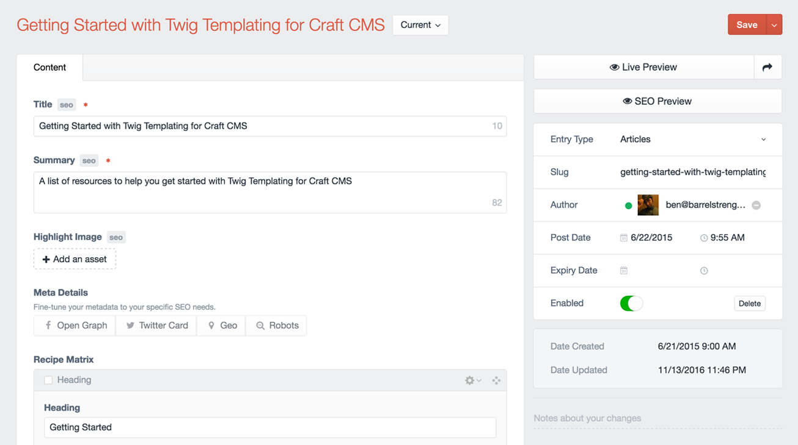

# About Sprout SEO

> Metadata is content too.

Sprout SEO provides you an intuitive, seamless, and flexible way to manage your SEO strategy within Craft CMS. Content authors will enjoy a clear visual relationship between content and metadata where they can focus on content and maximize visibility.

Sprout SEO helps manage several types of metadata:

- Search
- Social Sharing
- Structured Data
- Sitemaps
- Redirects

Refine your Metadata across three different levels of priority:

- Global Metadata
- Element Metadata
- Template Metadata

Often, the first time one of your visitors sees your content it is in search results or from a shared link. Make sure you're treating your metadata like a first class citizen alongside your content. 

Edit your content confidently. Throughout your content management experience, Sprout SEO will indicate which fields power the metadata on your site and provide some additional information about the scope and priority of how that field will affect your metadata.

## Global Metadata

[Global Metadata](./global-metadata.md) is managed from the Globals tab and filled out once when you setup Sprout SEO. Globals ensure you have metadata in place for your website identity and prepare Structured Data for your brand. Globals will help you communicate to the search engines information about your brand identity, how to get in touch, and general details so you always have something relevant about your business in search results and social sharing.


## Element Metadata

**Element Metadata** is managed with the powerful [Metadata Field](./element-metadata-field.md). The Metadata field allows you to configure how your metadata is handled for every entry. If you want to have a tight integration with your existing content fields, you can reuse existing fields and the Metadata field will blend right into your existing content. If you want detailed control, you can enable overrides for each type of metadata and manage it all manually.




## 100% control

Sprout SEO is powered by a single tag to your templates. Place the optimize tag within the `<head>` tag of your HTML page and you're up and running:

``` twig

```

While the simple setup above should handle most use cases, Sprout SEO is also extremely customizable and gives you fine-grained control over all of your metadata. Sprout SEO also supports:

- An API to add support for additional types of [URL-enabled Elements](../sitemaps/custom-url-enabled-sections.md)
- An API to add support for additional types of [Structured Data schemas](./custom-schema.md)
- Overriding metadata in your templates via [Template Overrides](./template-overrides.md)
- Overriding the default metadata templates using a [Custom Metadata Variable](./custom-metadata-variable.md)

## Metadata Spreadsheet

If you want to have a detailed understanding of all of the types of metadata supported by Sprout SEO and how the fields relate to those different types of metadata an their priorities, we have prepared a spreadsheet with all the details:

- [Sprout SEO - Metadata Levels & Priorities](https://docs.google.com/spreadsheets/d/1OWvJVPkxdiqiemT2AMX76yPacLfi3aBuyRhgRy4_NIU/edit?usp=sharing)


::: tip
We use the term **Metadata** to refer to all types of Metadata together. More specifically we may refer to **Meta Tags**, which are traditional metadata, and **Social Sharing**, which relies on a series of more specific Meta Tags around two specifications (Open Graph and Twitter) but applies to many other mediums as well from Pinterest to Slack chat, etc. Sprout SEO also let's you manage **Structured Data** (Knowledge Graph, Rich Cards) which supports many different **Schemas** and is output as JSON-LD in your templates. Finally, **Sitemap** metadata, allows you to define a list of URLs that search engines should know about on your site.
:::