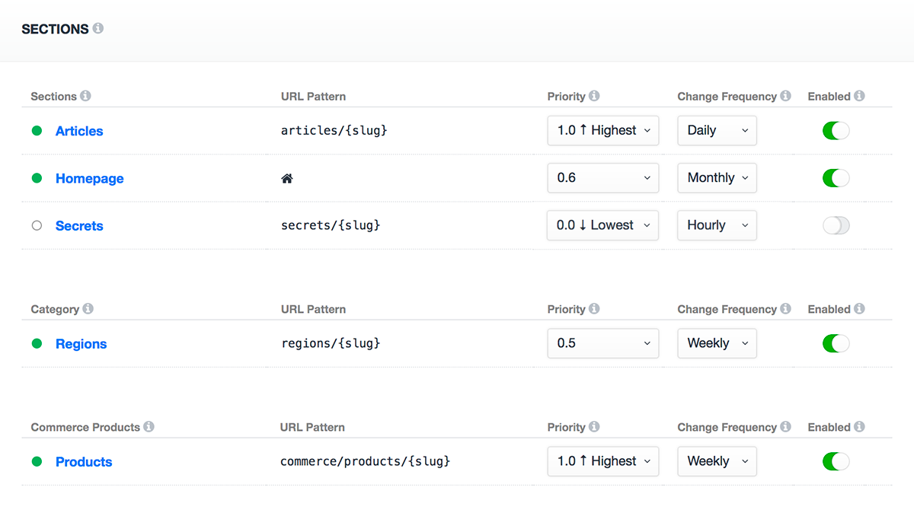

# About Sitemaps

Sitemaps gives you fine-grained control over your XML Sitemaps for standalone, multi-lingual, and multi-regional sites. Sitemaps are managed directly within Craft (no template updates required).



Sitemaps works seamlessly with Craft's default content types and allows for more advanced customization using custom content queries and custom pages. 

| Sitemap Type           | Description                            |
|:-----------------------|:---------------------------------------|
| Content Sitemaps       | Entries, Categories, Commerce Products |
| Content Query Sitemaps | Element Query via Condition Builder    |
| Custom Pages Sitemap   | Standalone page links                  |

## Sitemap XML

Your sitemap will consist of two or more XML Sitemap files. This will include a Sitemap Index file that lists all relevant sitemaps for your website and individual XML Sitemap files for each respective section. Individual Sitemap files will be broken into multiple files when the number of entries is more than the _Total Elements Per Sitemap_ setting value.

### Sitemap Index

Your Sitemap Index will be output when you visit the URL: `/sitemap.xml`

``` xml
<?xml version="1.0" encoding="UTF-8"?>
<sitemapindex xmlns="http://www.sitemaps.org/schemas/sitemap/0.9">
    <sitemap>
        <loc>{{ siteUrl }}sitemap-singles.xml</loc>
        <lastmod>{{ now|date('Y-m-d') }}</lastmod>
    </sitemap>
    <sitemap>
        <loc>{{ siteUrl }}sitemap-0a0c9e98-fe8b-430a-9b47-f3e521dd048e-1.xml</loc>
        <lastmod>{{ now|date('Y-m-d') }}</lastmod>
    </sitemap>
    <sitemap>
        <loc>{{ siteUrl }}sitemap-0a0c9e98-fe8b-430a-9b47-f3e521dd048e-2.xml</loc>
        <lastmod>{{ now|date('Y-m-d') }}</lastmod>
    </sitemap>
    <sitemap>
        <loc>{{ siteUrl }}sitemap-0a0c9e18-fe9b-910a-9b47-f3e522dd048e-1.xml</loc>
        <lastmod>{{ now|date('Y-m-d') }}</lastmod>
    </sitemap>
    <sitemap>
        <loc>{{ siteUrl }}sitemap-custom-pages.xml</loc>
        <lastmod>{{ now|date('Y-m-d') }}</lastmod>
    </sitemap>
</sitemapindex>
```

::: tip Note
When `devMode` is enabled, a query string will be appended to Sitemap URLs so that you can more easily confirm what sections are appearing in the sitemap.
:::

### Content Sitemaps (Single Language)

Each individual sitemap will list the URLs for the content in your URL-Enabled Sections.

``` xml
<?xml version="1.0" encoding="UTF-8"?>
<urlset xmlns="http://www.sitemaps.org/schemas/sitemap/0.9" xmlns:xhtml="http://www.w3.org/1999/xhtml">
    <url>
        <loc>http://website.com/example-url</loc>
        <lastmod>2012-08-08T03:08:03Z</lastmod>
        <changefreq>weekly</changefreq>
        <priority>0.5</priority>   
    </url>
        <url>
        <loc>http://website.com/example-url2</loc>
        <lastmod>2012-08-08T03:08:03Z</lastmod>
        <changefreq>weekly</changefreq>
        <priority>0.5</priority>   
    </url>
</urlset>
```

### Content Sitemaps (Multi-language)

If you have a multi-language site, your sitemap will adjust to reference URLs for all related content across languages.

``` xml
<?xml version="1.0" encoding="UTF-8"?>
<urlset xmlns="http://www.sitemaps.org/schemas/sitemap/0.9" xmlns:xhtml="http://www.w3.org/1999/xhtml">
    <url>
        <loc>http://website.com/english-content-url</loc>
        <lastmod>2012-08-08T03:08:03Z</lastmod>
        <changefreq>weekly</changefreq>
        <priority>0.5</priority>
        <xhtml:link rel="alternate" hreflang="en_us" href="http://website.com/english-content-url" />
        <xhtml:link rel="alternate" hreflang="de" href="http://website.com/de/german-content-url" />
        <xhtml:link rel="alternate" hreflang="es" href="http://website.com/es/spanish-content-url" />     
    </url>
    <url>
        <loc>http://website.com/de/german-content-url</loc>
        <lastmod>2012-08-08T03:08:03Z</lastmod>
        <changefreq>weekly</changefreq>
        <priority>0.5</priority>
        <xhtml:link rel="alternate" hreflang="en_us" href="http://website.com/english-content-url" />
        <xhtml:link rel="alternate" hreflang="de" href="http://website.com/de/german-content-url" />
        <xhtml:link rel="alternate" hreflang="es" href="http://website.com/es/spanish-content-url" />     
    </url>
    <url>
        <loc>http://website.com/es/spanish-content-url</loc>
        <lastmod>2012-08-08T03:08:03Z</lastmod>
        <changefreq>weekly</changefreq>
        <priority>0.5</priority>
        <xhtml:link rel="alternate" hreflang="en_us" href="http://website.com/english-content-url" />
        <xhtml:link rel="alternate" hreflang="de" href="http://website.com/de/german-content-url" />
        <xhtml:link rel="alternate" hreflang="es" href="http://website.com/es/spanish-content-url" />     
    </url>
</urlset>
```
## Content Query Sitemaps 

Use the Element Condition Builder to fine tune Content Sitemaps with more advanced requirements.

::: tip Note
If you have a section with multiple Entry Types and you wish to exclude one of the Entry Types from your XML Sitemap, you can choose to disable the main Content Sitemap for that section and build a custom query with a Content Query Sitemap.
:::

## Custom Pages Sitemap

Enable Custom Pages to add any number of one-off urls to your sitemap. Custom Pages can be managed in Multi-Site sitemaps on a per-site basis.

## Developers

### Custom Sitemap Metadata

To add Sitemap Metadata support for custom Element Types, implement the `ElementSitemapMetadataInterface` class and register your new class via `EVENT_REGISTER_ELEMENT_SITEMAP_METADATA`.

``` php
use BarrelStrength\Sprout\sitemaps\sitemapmetadata\ElementSitemapMetadataInterface;

class MyCustomElementSitemapMetadata implements ElementSitemapMetadataInterface
{
  ...
}
```

See the Sprout codebase for examples.

## Settings

Read the [Config Settings](./configuration/sprout-config.md) documentation to explore and customize settings.

## Updates

See [update guides](/update-guides/sitemaps.md) for the Redirects and Framework modules.
